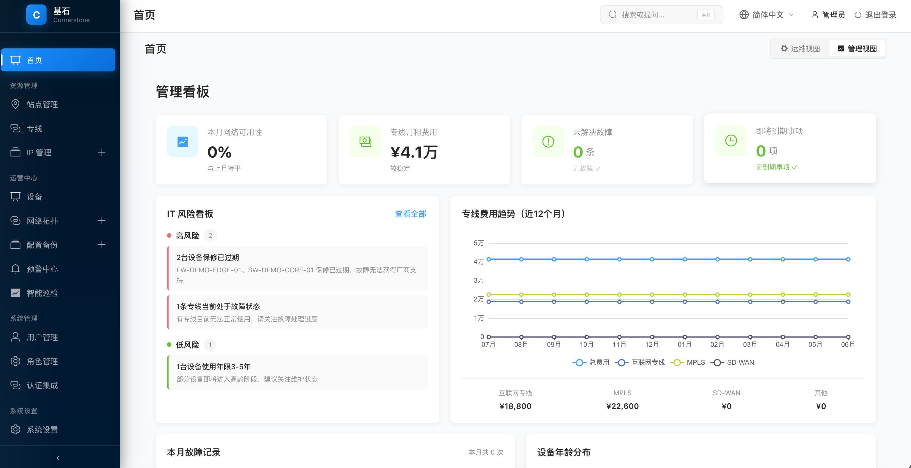
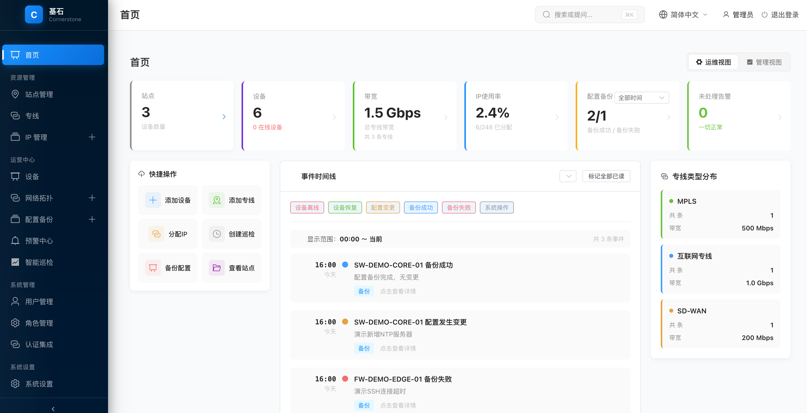
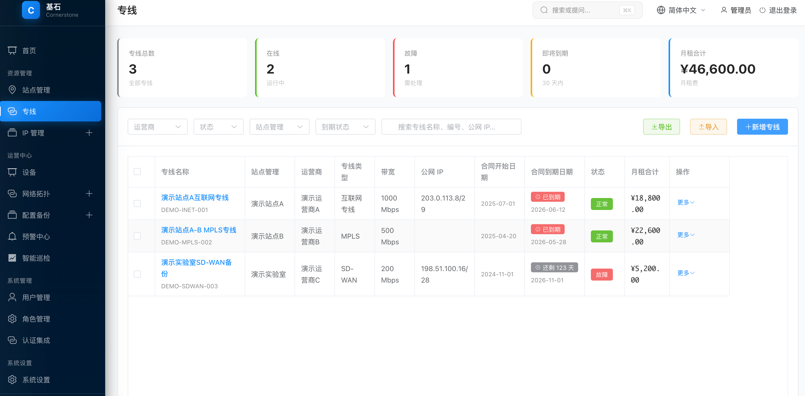
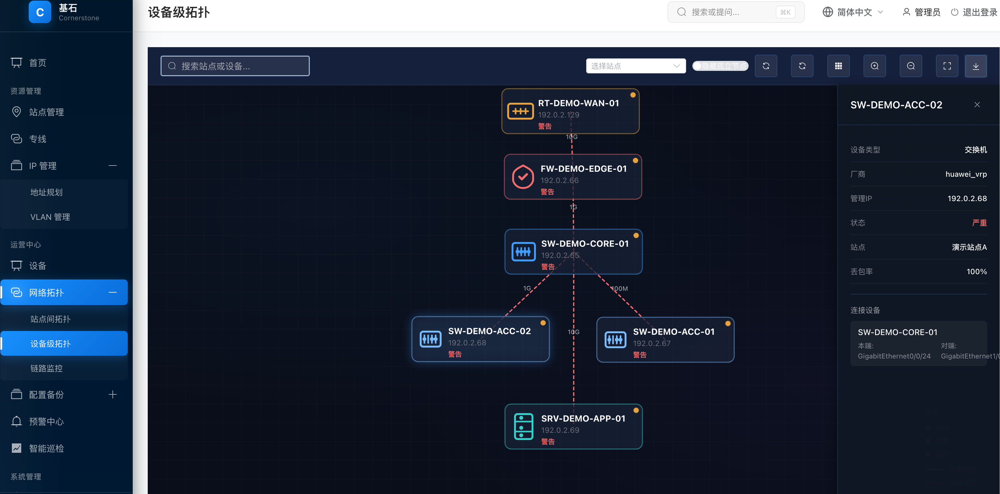
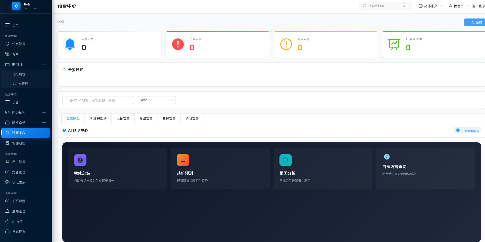

# 基石 Cornerstone

> IT 基础设施资源管理平台 — 站点 / 专线 / IP / 设备 / 备份 / 拓扑 / 预警 / AI 一体化管理。

[](LICENSE)
[](https://www.python.org/)
[](https://vuejs.org/)
[](https://fastapi.tiangolo.com/)

> ⚠️ **安全提醒**：首次部署后请立即修改默认管理员密码（`INITIAL_ADMIN_PASSWORD`），并将 `SECRET_KEY` 替换为随机字符串。生产环境推荐使用 PostgreSQL。

---

## 目录

- [项目简介](#项目简介)
- [核心特性](#核心特性)
- [技术栈](#技术栈)
- [快速开始](#快速开始)
- [功能模块](#功能模块)
- [项目结构](#项目结构)
- [认证与权限](#认证与权限)
- [国际化](#国际化)
- [AI 能力](#ai-能力)
- [部署](#部署)
- [License](#license)

---

## 项目简介

**基石** 是一款面向中大型网络运维团队的 IT 基础设施资源管理平台，提供从站点、专线、IP、设备到配置备份与拓扑监控的全链路资源台账管理能力，并集成基于大语言模型的智能搜索、备份分析与异常预测。

适用场景：
- 多分支站点的网络资源台账管理
- 运营商专线 / MPLS / SD-WAN 合同到期跟踪
- 子网与 IP 地址生命周期管理
- 网络设备配置自动备份与版本对比
- AI 辅助的故障排查与运维问答

## 核心特性

| 特性 | 说明 |
|------|------|
| 🏢 站点台账 | 多站点统一管理，支持运行状态监控、Zabbix 一键跳转 |
| 🔌 专线管理 | 合同到期预警、带宽 / 费用追踪、变更历史记录 |
| 🌐 IPAM | 子网 / IP 双层管理，使用率可视化，IP 冲突拦截 |
| 💻 设备台账 | 凭证加密存储、保修预警、LLDP 自动发现 |
| 💾 配置备份 | Netmiko 驱动的多厂商配置采集，版本 Diff 对比 |
| 🗺️ 拓扑可视化 | 站点 / 设备双视图，基于 G6 5.x 的交互式拓扑，支持 PNG/JPG/PDF 导出 |
| 📊 管理看板 | IT负责人专属仪表盘：网络可用性、专线费用趋势、风险看板、故障汇总 |
| 📈 运营月报 | 自动生成 PDF 月报，含封面、执行摘要、可用性分析、费用构成、故障记录 |
| 🚨 预警中心 | 规则预警 + AI 异常检测双引擎 |
| 🤖 AI 助手 | 自然语言查询、备份配置审计、智能预测 |
| 🔐 RBAC | JWT + 细粒度权限，支持 OAuth2 / SAML SSO / LDAP |
| 🌍 国际化 | 内置中英双语，运行时切换 |

## 技术栈

**前端**
- Vue 3.5 + TypeScript + Vite 5
- Element Plus（UI）/ ECharts（图表）/ AntV G6（拓扑）
- Pinia（状态）/ Vue Router / vue-i18n

**后端**
- FastAPI 0.104 + Python 3.11+
- SQLAlchemy 2.0（异步） + Alembic
- PostgreSQL（生产） / SQLite（开发）
- Redis（缓存，可选）
- Netmiko / Paramiko（设备连接）
- APScheduler（定时任务）
- ldap3（LDAP 认证）

**AI**
- 兼容 OpenAI / DeepSeek / 通义千问 / Claude / 本地 Ollama

## 快速开始

### 前置要求

- Node.js ≥ 18
- Python ≥ 3.11
- (可选) PostgreSQL ≥ 14、Redis ≥ 6

### 本地开发

```bash
# 1. 克隆仓库
git clone https://github.com/your-org/cornerstone.git
cd cornerstone

# 2. 配置后端
cd backend
cp .env.example .env       # 编辑 .env 填写数据库与 SECRET_KEY
python -m venv venv
source venv/bin/activate    # Windows: venv\Scripts\activate
pip install poetry && poetry install
python init_db.py           # 初始化数据库与默认数据
uvicorn src.main:app --reload --port 8000

# 3. 启动前端（新终端）
cd frontend
npm install
npm run dev
```

访问：

| 服务 | 地址 |
|------|------|
| 前端 | http://localhost:5173 |
| 后端 API | http://localhost:8000 |
| API Swagger | http://localhost:8000/docs |

默认账号：`admin` / `INITIAL_ADMIN_PASSWORD` 中配置的密码。

### Docker Compose 部署（推荐）

```bash
# 1. 克隆仓库
git clone https://github.com/pancq/cornerstone.git
cd cornerstone

# 2. 配置环境变量
cp .env.docker.example .env
# 至少修改：POSTGRES_PASSWORD、SECRET_KEY、INITIAL_ADMIN_PASSWORD、CORS_ORIGINS

# 3. 构建并启动（首次约 3~5 分钟）
docker compose up -d --build

# 4. 查看状态
docker compose ps
```

访问 `http://localhost`，使用 `admin` + `INITIAL_ADMIN_PASSWORD` 登录。

常用命令：

```bash
# 查看日志
docker compose logs -f backend

# 升级
git pull
docker compose up -d --build

# 停止 / 销毁（保留数据卷）
docker compose stop
docker compose down
```

部署指南见下方 [部署](#部署) 章节。

## 功能模块

### 1. 仪表盘

**运维视图**（运维工程师首页）：



**管理视图**（IT负责人首页）：



- **运维视图**：专线 / IP / 设备 / 备份 状态卡片、近期预警、资源总览（运维工程师）
- **管理视图**：IT负责人专属看板 - 网络可用性、专线月租费用、未解决故障、即将到期事项、IT风险看板、专线费用趋势图、设备生命周期分布、本月故障汇总（IT负责人）
- **super_admin**：支持在两个视图之间自由切换，菜单按权限自动过滤

### 2. 站点管理

站点列表（位置、联系人、专线数、状态）、告警高亮、Zabbix 跳转、电话一键复制、CSV 导入导出。

### 3. 专线管理

合同到期预警、带宽 / 费用、运行状态、变更历史、详情页。



### 4. IPAM
子网展示、IP 分配 / 回收、使用率色块、冲突拦截、CSV 导入。

### 5. 设备台账
设备列表、管理 IP、凭证加密、保修预警、LLDP 链路自动发现。

### 6. 配置备份
备份历史、手动 / 定时备份任务、配置查看 / 下载、最近版本 Diff、AI 配置审计。

### 7. 拓扑可视化

基于 AntV G6 的交互式拓扑可视化，支持多种布局、导出图片/PDF：



- **站点拓扑**：基于专线关系的全局站点视图
- **设备拓扑**：基于 LLDP 数据的物理链路视图
- **导出功能**：支持将拓扑图导出为 PNG、JPG、PDF 格式文件

### 8. 预警中心

**规则预警**：IP / 专线 / 设备到期、备份失败、子网容量。



**AI 智能检测**：设备状态异常、专线连通性、备份成功率趋势、IP 池耗尽预测。

### 9. 智能巡检
定期对设备 / 专线 / 子网进行健康检查并生成巡检报告。

### 10. 运营月报

一键生成 PDF 格式月度运营报告，包含封面设计、执行摘要、关键指标（网络可用性、专线费用、故障次数）、费用构成条形图、故障记录明细、下月重点关注事项，支持下载。

### 11. 系统管理
- 用户 / 角色 / 权限管理（RBAC）
- 通知管理（邮件 / Webhook）
- 认证集成（OAuth2 / SAML SSO / LDAP）
- 日志设置（审计 / 登录日志保留策略、自动清理）
- AI 设置（模型 API Key 配置）
- 审计日志查询

### 8. 预警中心
**规则预警**：IP / 专线 / 设备到期、备份失败、子网容量。
**AI 智能检测**：设备状态异常、专线连通性、备份成功率趋势、IP 池耗尽预测。

### 9. 智能巡检
定期对设备 / 专线 / 子网进行健康检查并生成巡检报告。

### 10. 运营月报

一键生成 PDF 格式月度运营报告，包含封面设计、执行摘要、关键指标（网络可用性、专线费用、故障次数）、费用构成条形图、故障记录明细、下月重点关注事项，支持下载。

### 11. 系统管理
- 用户 / 角色 / 权限管理（RBAC）
- 通知管理（邮件 / Webhook）
- 认证集成（OAuth2 / SAML SSO / LDAP）
- 日志设置（审计 / 登录日志保留策略、自动清理）
- AI 设置（模型 API Key 配置）
- 审计日志查询


## 项目结构

```
cornerstone/
├── backend/                      # FastAPI 后端
│   ├── src/
│   │   ├── api/                  # API 路由
│   │   ├── models/               # SQLAlchemy ORM
│   │   ├── schemas/              # Pydantic Schema
│   │   ├── services/             # 业务服务（AI / 采集 / 监控）
│   │   ├── tasks/                # 定时任务
│   │   ├── utils/                # 工具
│   │   └── main.py               # 应用入口
│   ├── alembic/                  # 数据库迁移
│   ├── pyproject.toml
│   └── .env.example
├── frontend/                     # Vue 3 前端
│   ├── src/
│   │   ├── api/                  # Axios 封装
│   │   ├── app/                  # 路由
│   │   ├── components/           # 通用组件
│   │   ├── features/             # 业务模块
│   │   ├── i18n/                 # 国际化
│   │   ├── locales/              # 中英文翻译
│   │   ├── store/                # Pinia
│   │   └── App.vue
│   └── package.json
├── docs/                         # 文档
├── LICENSE
└── README.md
```

## 认证与权限

- **认证**：JWT Bearer Token（默认 8 小时过期，可刷新）
- **登录**：用户名密码 + 图形验证码 / OAuth2 / SAML / LDAP
- **权限**：RBAC，按资源 + 操作（如 `sites:read`、`devices:write`）
- **审计**：所有写操作自动记录到 `audit_logs`

内置角色：

| 角色 | 权限范围 | 首页视图 |
|------|----------|---------|
| `super_admin` | 全部权限 | 可切换运维/管理视图 |
| `engineer` | IT运维工程师（所有业务模块读写） | 运维视图（操作型） |
| `viewer` | **IT负责人**（管理看板 + 专线/预警/日志只读） | 管理视图（统计型） |

IT负责人（viewer）权限：仅查看管理层关心的数据，不接触技术运维细节。

## 国际化

支持简体中文（`zh-CN`）与英文（`en-US`），可在导航栏右上角切换，选择后写入 `localStorage`。

翻译文件：[frontend/src/locales/](frontend/src/locales/)

## AI 能力

在「系统管理 → AI 设置」配置模型 API Key 后启用：

| 能力 | 入口 | 说明 |
|------|------|------|
| 全局自然语言搜索 | 顶部 ⌘K | 「上海有哪些设备离线？」 |
| 配置备份审计 | 备份详情 | AI 检查配置安全风险 |
| 智能预测 | 预警中心 | 趋势预测 / 根因分析 |
| 智能问答 | 各模块 | 上下文感知的运维问答 |

支持模型：OpenAI、DeepSeek、通义千问、Claude、本地 Ollama。

## 部署

推荐生产环境使用 Docker Compose：

```bash
cp .env.docker.example .env
# 修改 .env 中的 POSTGRES_PASSWORD / SECRET_KEY / INITIAL_ADMIN_PASSWORD / CORS_ORIGINS
docker compose up -d --build
```

部署指南见下方 Docker Compose 部署章节。

## License

[MIT License](LICENSE)
